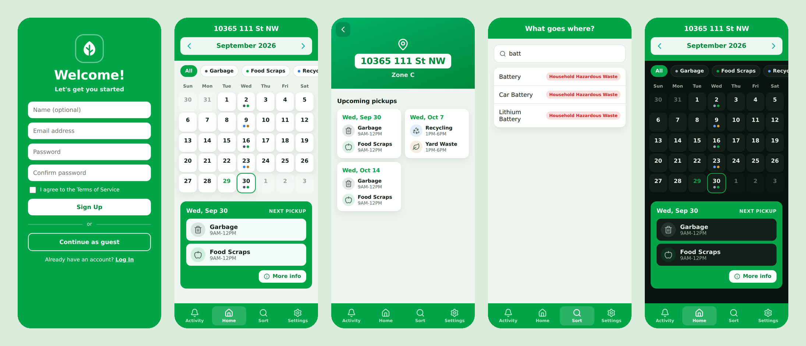
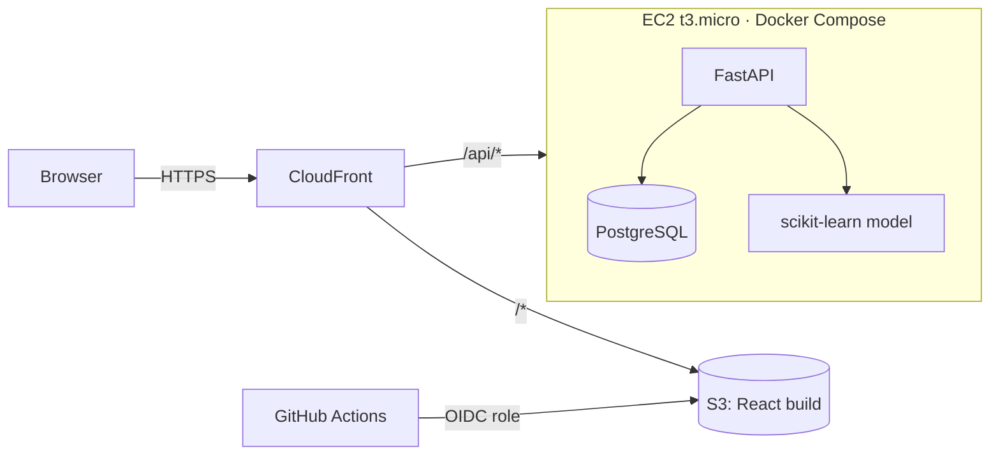

# WasteWise: Waste Collection App Redesign

[](https://github.com/hdurrani13/wastewise/actions/workflows/ci.yml)

A full-stack build of a UX redesign for a municipal waste-collection app. Residents can check their pickup calendar, get reminders the evening before pickup, and look up which bin an item goes in. If an item isn't in the database, a machine-learning model predicts the bin.



> **Unofficial student project.** This is a concept based on a university UX course (DESN 240, MacEwan University). It isn't affiliated with or endorsed by the City of Edmonton or any municipality. Pickup schedules are generated sample data.

## Why this exists

In our design course, my team studied an existing city waste app and interviewed residents about it. We heard the same complaints again and again:

| What we heard | What this redesign does |
| --- | --- |
| The side-scrolling calendar is awkward; people want a normal month grid | **Month-grid calendar** with coloured dots per collection type. Tap a day for details |
| People want to choose the collection type *before* finding a date | **Filter chips** (Garbage, Food Scraps, Recycling, Yard Waste) above the calendar |
| The built-in game distracts from the app's purpose | **Removed** |
| Being forced to give an address and accept notifications up front feels pushy | **Guest mode**, a **skippable** address step, and notifications are an explicit opt-in |
| Language settings are buried | **Language is the first onboarding step** and is always in Settings |
| The item search is the most useful feature | Kept and extended with an **ML fallback** for items that aren't listed |
| Notifications are unreliable | Reminders show up in an **Activity feed**, generated server-side and de-duplicated |

More detail in [docs/DESIGN.md](docs/DESIGN.md).

## Features

- **Onboarding:** choose a language, sign up / log in / continue as guest, add an address (optional), opt in to reminders
- **Calendar:** month view, per-type filters, holiday-shifted pickups flagged ("moved from Mon, Sep 7 (holiday)")
- **More Info:** the next three pickup days with time windows
- **Activity:** pickup reminders ("Garbage + Food Scraps pickup tomorrow") and city announcements, with read/unread state
- **What Goes Where:** instant search over ~125 items, plus an ML prediction with confidence scores for anything else
- **Settings:** address, language (EN / FR / ES / PA), dark mode, reminders, change password
- Accounts with hashed passwords (bcrypt) and JWT auth; guest preferences carry over when you sign up

## Architecture



- **Frontend:** React 19 + TypeScript + Vite, React Router, mobile-first CSS with light/dark themes
- **Backend:** FastAPI, SQLAlchemy 2.0, Pydantic v2, PostgreSQL (SQLite for local dev/tests)
- **ML:** scikit-learn (TF-IDF word + character n-grams, logistic regression)
- **Infra:** Terraform for S3, CloudFront, EC2, IAM, OIDC and a Budget; Docker Compose; GitHub Actions CI

Some design decisions:

- **One origin.** CloudFront serves the site and forwards `/api/*` to the API, so there's no CORS setup and no mixed content.
- **The API only accepts traffic from CloudFront.** The EC2 security group allows port 80 only from AWS's CloudFront prefix list. There's no SSH; shell access is through SSM.
- **No long-lived AWS keys in GitHub.** The deploy workflow assumes an IAM role through OIDC, and that role can only write to the site bucket and invalidate the cache.
- **Schedules are computed, not stored.** `schedule.py` generates pickups from each zone's rules: alternating weeks, seasonal yard waste, and Alberta stat-holiday shifts (including Easter-based Good Friday). The functions are pure, so they're easy to unit test.
- **The activity feed is generated when it's read**, with de-duplication keys, so there's no cron job to run or monitor.

## The ML model

`POST /api/items/classify` looks for an exact database match first. If there isn't one, it asks the model.

- Training data: the item list ([`items.csv`](backend/data/items.csv)), augmented with modifiers ("old", "empty", "broken"…), plus a small set of material and synonym examples ([`training_extra.csv`](backend/data/training_extra.csv)).
- Features: word 1–2-grams plus character 2–5-grams. The character n-grams help with spelling variants and typos, like "aluminium" vs "aluminum".
- **Evaluation:** 5-fold cross-validation that holds out whole items, so the model is always tested on items it has never seen. Accuracy is **~53%** across 5 classes, where always guessing the most common bin would get ~26%.

That number is modest because the dataset is tiny. That's why the UI labels predictions clearly and always shows the confidence and runner-up bins. The obvious next step is more labelled data, and the city's full item list would be the natural source.

```bash
cd backend && python -m app.ml.train   # prints a per-class report and saves the model
```

## Run it locally

**With Docker** (Postgres + API + nginx):

```bash
docker compose up --build
# open http://localhost:8080
```

**Without Docker:**

```bash
# API (http://localhost:8000/docs has interactive API docs)
cd backend
python -m venv .venv && source .venv/bin/activate
pip install -r requirements-dev.txt
uvicorn app.main:app --reload

# Web (http://localhost:5173, proxies /api to :8000)
cd frontend
npm install
npm run dev
```

Try the address `10365 111 St NW`. Any address in `number street` form works.

## Tests

```bash
cd backend && pytest        # 22 tests: schedule rules, holidays, auth, API, ML fallback
cd frontend && npm test     # calendar grid utilities
```

CI runs lint and tests for both apps, `terraform validate`, and a Docker build on every push.

## Deploy to AWS

```bash
cd infra/terraform
cp terraform.tfvars.example terraform.tfvars   # fill in your repo + email
terraform init && terraform apply
```

Then add the `deploy_role_arn` output as the GitHub secret `AWS_DEPLOY_ROLE_ARN`, add `SITE_BUCKET` and `CLOUDFRONT_DISTRIBUTION_ID` as repository variables, and run the **Deploy frontend** workflow. A $10/month budget alert is included. The stack is sized for the free tier / a few dollars a month.

## API

| Method | Path | Description |
| --- | --- | --- |
| POST | `/api/auth/register` · `/api/auth/login` | Create account / get JWT |
| GET, PATCH | `/api/me` | Profile, address, language, dark mode, reminders |
| POST | `/api/me/password` | Change password |
| GET | `/api/schedule?year=&month=&types=&address=` | Month of pickups (guests pass `address`) |
| GET | `/api/schedule/next?count=` | Next pickup days |
| GET | `/api/items?q=` | Search items |
| POST | `/api/items/classify` | Database match or ML prediction |
| GET | `/api/activity` · POST `/api/activity/{id}/read` | Reminder + announcement feed |

## What I'd do next

- Load real schedules and addresses from a city open-data portal instead of sample zones
- Real push notifications (Web Push or a React Native client) on top of the activity feed
- Move Postgres to RDS and the API to ECS/Fargate if traffic ever justified it
- Alembic migrations, rate limiting on auth endpoints, and end-to-end Playwright tests in CI

## Credits

- **UX research, interviews, personas, wireframes and Figma mockups:** DESN 240 group project by Hamza Durrani with Julia, Teagan and Tarik
- **Full-stack implementation:** Hamza Durrani

MIT licensed.
